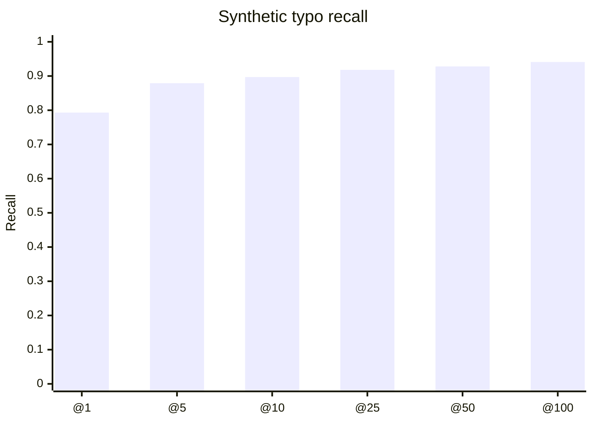

# String Embed

A small PyTorch model for finding likely duplicate names or short strings.

The goal is candidate generation: turn a big table into embeddings, pull back the nearest matches, then let your normal dedupe logic make the final call. It is useful when all-pairs fuzzy matching is too slow, but you still care about typos, initials, spacing, and token order.

The default model has 200,544 parameters. It normalizes text, keeps the first 32 characters, and returns L2-normalized vectors that can be searched with cosine similarity.

## Install

This repo uses [uv](https://docs.astral.sh/uv/).

```bash
uv sync
```

For notebooks, tests, and packaging:

```bash
uv sync --group dev
```

## How To Use It

In a real dedupe job, use `string-embed` as the first pass:

1. Train or fine-tune on strings from your own database.
2. Embed the records you want to search.
3. Store those embeddings next to record IDs.
4. For each incoming record, search for the nearest 50-100 candidates.
5. Run a stricter verifier on those candidates only.

For small tables, NumPy is enough. For larger tables, put the vectors in FAISS, pgvector, SQLite vec, or whatever vector index you already run.

## Train

The main workflow is in `train_and_test.ipynb`. It trains the tiny model, saves `tiny_string_embed.pt`, and runs a small preselection benchmark.

Here is the same training path as a script:

```bash
uv run python - <<'PY'
from string_embed.testdata import load_words
from string_embed.train import train

names = load_words(limit=10_000, seed=13)

result = train(
    names,
    epochs=50,
    batch_size=8192,
    lr=1e-3,
    context_chars=32,
    sample_size=32,
    output_path="tiny_string_embed.pt",
    progress=True,
)

print(f"params: {result.parameter_count:,}")
print(f"final loss: {result.final_loss:.4f}")
print(f"training time: {result.training_seconds:.2f}s")
PY
```

For production, replace `names` with the names or short labels from your own system. The default training score is name-oriented: it likes compact edit similarity, token overlap, sorted-token similarity, and initials. That is why `John A Smith`, `Smith John`, and `Jon Smith` can land near each other without treating the embedding as the final answer.

The included checkpoint was trained for 50 epochs on 10,000 words. On this workspace's NVIDIA GeForce RTX 5090, the same recipe took 783.84 seconds, about 13 minutes 4 seconds, or 15.68 seconds per epoch.

## Build A Candidate Index

This example embeds a small customer table and searches it with plain NumPy. In a real service, keep `ids`, `names`, and `embeddings` in your storage layer.

```python
import numpy as np
import torch

from string_embed import StringEmbedder

records = [
    {"id": 101, "name": "John A Smith"},
    {"id": 102, "name": "Jane Baker"},
    {"id": 103, "name": "Smith, John"},
]

checkpoint = torch.load("tiny_string_embed.pt", map_location="cpu")
model = StringEmbedder(**checkpoint["model_args"])
model.load_state_dict(checkpoint["model_state_dict"])

ids = np.array([record["id"] for record in records])
names = [record["name"] for record in records]
embeddings = model.embed_words(names)

def candidates(query: str, top_k: int = 100):
    query_embedding = model.embed_words([query])[0]
    scores = embeddings @ query_embedding
    best = np.argsort(-scores)[:top_k]
    return [
        {"id": int(ids[index]), "name": names[index], "score": float(scores[index])}
        for index in best
    ]

print(candidates("Jon Smith", top_k=2))
```

After this step, run your normal verifier on the returned records: edit distance, rules, address/date-of-birth checks, an LLM, a supervised classifier, or whatever your dedupe stack uses. The embedding model should make that verifier cheaper by cutting the search space down.

## Quick Query

For a quick local check:

```bash
uv run python - <<'PY'
import torch

from string_embed import StringEmbedder, nearest_by_embedding
from string_embed.testdata import load_words

checkpoint = torch.load("tiny_string_embed.pt", map_location="cpu")
model = StringEmbedder(**checkpoint["model_args"])
model.load_state_dict(checkpoint["model_state_dict"])

words = load_words(limit=10_000, seed=13)
for word, distance in nearest_by_embedding(model, "John Smith", words, n=10):
    print(f"{word}\t{distance:.6f}")
PY
```

## What The Model Looks At

The model uses a few simple signals:

- character n-grams over the full normalized string
- pooled token embeddings, so token order can change
- a small token-order convolution, so order is not completely ignored

Training samples triplets on the fly. For each anchor string it scores a small random pool, picks a closer positive and a farther negative, and trains cosine similarity to keep that order.

## Recall

The included `tiny_string_embed.pt` checkpoint was evaluated on 1,000 synthetic typo/spacing queries against a 10,000-word index. On that benchmark, top-100 recall is 94.1%.



| Metric | Value |
| --- | ---: |
| recall@1 | 79.3% |
| recall@5 | 87.9% |
| recall@10 | 89.7% |
| recall@25 | 91.8% |
| recall@50 | 92.8% |
| recall@100 | 94.1% |
| median rank | 1 |
| p95 rank | 206.2 |

Reproduce it with:

```bash
uv run python benchmarks/recall.py --checkpoint tiny_string_embed.pt
```

Treat this as a smoke test, not a guarantee. Real recall depends on your data, your duplicate patterns, and how many candidates you pass to the verifier.

## Release Checks

```bash
uv sync --group dev
uv run pytest
uv run pyright
uv run python -m build
uv run twine check dist/*
```
